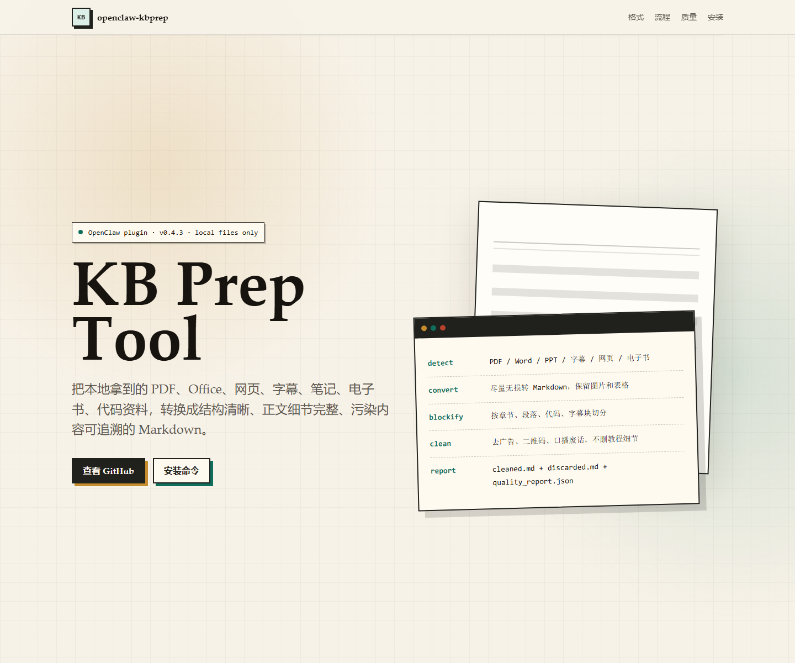

# KB Prep Tool

KBPrep converts local raw source files into clean Markdown for Obsidian or LLM Wiki workflows. It is a toolkit with a Python worker core, a standalone Node CLI, and an OpenClaw adapter.

KBPrep focuses on preparation only: detect file type, convert as losslessly as possible, split by content structure, remove pollution, preserve concrete knowledge details, and keep discarded/review material traceable.

It does not build a RAG index or download from remote platforms. By default it uses `profile="curated_obsidian_kb"` and renders an Obsidian-ready wiki folder from the cleaned blocks. Use `profile="standard"` only when you explicitly want a broad cleaned Markdown file instead of knowledge-base curation.

OpenClaw is one supported host adapter, not the project boundary. The npm package name is `kbprep`; `openclaw-kbprep` is only the OpenClaw adapter/plugin id and the current GitHub repository slug. Non-OpenClaw users can call the same worker through the standalone CLI or the Python worker module.



Public showcase page source: [`docs/index.html`](docs/index.html). Enable GitHub Pages from the repository `docs/` folder to publish it as a project page.

For local preview, prefer the HTTP preview instead of opening the Windows `file://` path directly:

```bash
npm run docs:serve
```

Then open the printed `http://127.0.0.1:.../` URL. This avoids Windows local path escaping issues in embedded browsers.

## Use It For One Thing

Give KBPrep a local raw file. It produces readable Markdown for a knowledge base.

Default entry:

```text
kbprep_prepare(input_path, output_root)
```

Standalone CLI entry:

```bash
kbprep-analyze --input ./source.pdf
kbprep-prepare --input ./source.pdf --output ./.kbprep/source
kbprep-cleanup --output ./.kbprep/source --action finalize
```

Full CLI usage is in [`docs/standalone-cli.md`](docs/standalone-cli.md).

Expected output:

- `original/`: original file backup
- `converted.md`: converted Markdown before cleaning
- `blocks.jsonl`: content blocks in original order
- `cleaned.md`: cleaned process output for audit and fallback reading
- `obsidian/`: default curated final deliverable with full text, topic notes, and audit files
- `discarded.md`: removed pollution with reasons
- `review_needed.md`: uncertain content for manual review
- `images/`: copied local or embedded image assets referenced by the Markdown output
- `quality_report.json`: retention and quality checks

Final deliverables are profile-specific:

- `profile="curated_obsidian_kb"`: keep `latest_outputs.obsidian_dir` and start from `latest_outputs.obsidian_index`. `latest_outputs.final_md` is intentionally `null` and `latest_outputs.final_artifact_type` is `"obsidian_dir"`.
- `profile="standard"` and older broad-cleaning profiles: keep `latest_outputs.final_md`, a source-side Markdown file named from the source stem. `latest_outputs.final_artifact_type` is `"markdown"`.

The default profile adds a second knowledge-base curation layer after ordinary cleaning. It removes author names in headings, author bios, identity wrappers, self-introductions, image-only artifacts, and obvious non-knowledge packaging while keeping method/case body text verbatim. It also writes an Obsidian-ready folder:

```text
kbprep_prepare(input_path, output_root, profile="curated_obsidian_kb")
```

- `obsidian/00-索引.md`: wiki entry point with links to generated notes
- `obsidian/01-完整正文.md`: cleaned full text for reading/search
- `obsidian/认知/`: concept and viewpoint notes
- `obsidian/方法/`: workflow, method, tool, SOP, and prompt notes
- `obsidian/案例/`: case-oriented notes
- `obsidian/_audit/discarded.md`: removed material with block metadata and reasons
- `obsidian/_audit/review_needed.md`: uncertain material for manual review
- `obsidian/_audit/source-map.jsonl`: block-to-note trace map
- `obsidian/_audit/cleaning-report.md`: curation summary

The profile does not summarize or rewrite source body paragraphs. It may sanitize generated note titles and heading display text by removing author/name prefixes, but source knowledge paragraphs are either kept, removed into audit files, or marked for review.

For default curated use, the Obsidian folder is the result to move into or keep in your knowledge base. For example, `kbprep_prepare(..., profile="curated_obsidian_kb")` publishes `output_root/obsidian/00-索引.md` as the entry point and keeps `cleaned.md` as process material. If you explicitly choose `profile="standard"`, KBPrep publishes source-side Markdown instead: `OpenClaw橙皮书.pdf` becomes `OpenClaw橙皮书.md`, and an existing Markdown source becomes `name.cleaned.md` instead of being overwritten. Image assets for standard final Markdown are copied beside the source as `name.assets/`.

`discarded.md`, `review_needed.md`, and `evidence/marketing_pages.md` include compact trace comments before each block: block id, type, page range when available, heading path, risk tags, confidence, and reason. The text itself is kept verbatim so a human can recover or audit anything that was removed from `cleaned.md`.

Intermediate audit files remain under `output_root`. By default KBPrep uses `artifact_policy="keep_latest"`: the direct-use result is published beside the source, while old `runs/` history is pruned so normal users do not accumulate endless cache-like artifacts. Use `artifact_policy="keep_all"` only when you intentionally want full history for auditing, or `artifact_policy="final_only"` when you want the leanest run history.

When you are satisfied with the result, run:

```text
kbprep_cleanup(output_root, action="finalize")
```

Finalize removes temporary audit/process material under `output_root` (`runs/`, `original/`, `converted.md`, `blocks.jsonl`, `discarded.md`, `review_needed.md`, `quality_report.json`, `parts/`, `images/`, and batch process files). It keeps the source file, the profile-specific final deliverable, and a tiny `kbprep_manifest.json` or `kbprep_batch_manifest.json`. In curated mode it preserves `obsidian/`; in standard mode it preserves the source-side Markdown and assets. If `review_needed.md` still has content, finalize stops unless `confirm_review_needed=true` is passed.

If you are not sure yet, do nothing: `keep_latest` keeps only a short review window by count and age. You can also run `kbprep_cleanup(output_root, action="expired", older_than_days=7)` to remove old run history, or `kbprep_cleanup(output_root, action="all")` to remove known intermediate artifacts without checking acceptance state.

Start with `mode="rules_only"`. Use `mode="rules_plus_review_pack"` only when you want an AI or human to review uncertain blocks. Use `mode="ai_review"` only when OpenClaw subagents are available and you accept the extra model call. The standalone CLI does not yet provide a generic LLM backend; CLI users should use `rules_only` or `rules_plus_review_pack` and apply reviewed metadata patches with `kbprep-apply-review`.

## Tools

- `kbprep_prepare`: main tool. Convert one local source file into the profile-specific final deliverable.
- `kbprep_analyze`: optional read-only check for file type, PDF subtype, text quality, and route.
- `kbprep_preflight`: optional runtime check before large PDF/OCR work.
- `kbprep_apply_review`: optional guarded metadata patch for human/AI review results. It cannot rewrite source text.
- `kbprep_cleanup`: remove intermediate artifacts after acceptance, or prune expired run history.
- `kbprep_prepare_batch`: optional directory mode. It is for repeated local files, not platform harvesting.

For audio/video, v1 handles local subtitle, transcript, or ASR text files. It does not automatically download or transcribe binary media.
Batch runs write `batch_inventory.json`, so unsupported or skipped local files are visible instead of silently ignored. Audio/video binaries are marked as `media_binary_not_transcribed_in_v1`; unknown extensions are marked as unsupported.
Batch mode is conservative with heavy conversion files: PDF, image, MOBI, and legacy Office files are processed one at a time even when `convert_jobs` is greater than 1. Lightweight text/code/subtitle/modern Office XML files may use `convert_jobs`.

`quality_report.json` includes `detail_retention`, a block-level retention inventory for operation steps, tools/platforms, parameters, links, prompts, code, tables, and numeric details. Discarding blocks that contain these concrete knowledge signals is treated as a strict QA failure unless they are known pollution with no detail signal.
It also includes `output_retention`, which checks that links, parameter assignments, code blocks, and table blocks from kept/review/evidence blocks appear in their rendered destination: `cleaned.md`, `review_needed.md`, or `evidence/marketing_pages.md`. Missing rendered detail signals are strict QA failures.

GitHub-style source and config files such as `.py`, `.js`, `.ts`, `.sh`, `.ps1`, `.sql`, `.yaml`, `.toml`, and `.ini` are handled as direct code inputs. KBPrep wraps the original file in a fenced Markdown code block so code, parameters, links, and failure-handling details stay intact.

Saved HTML pages are converted with visible headings, paragraphs, lists, links, and image references preserved. Local HTML images are copied into `images/` and rewritten to portable Markdown paths.

Jupyter notebooks (`.ipynb`) are handled as structured local source files. Markdown cells are kept as Markdown, code cells are kept in fenced code blocks using the notebook language when available, and text outputs are preserved under per-cell output sections so tutorial parameters, examples, errors, and results remain readable.

## Runtime Selection

On first use, KBPrep creates its own Python runtime at `.kbprep/venv` inside the package directory and installs the Python worker dependencies there. It does not install MinerU, torch, PyMuPDF, or other worker dependencies into system Python.

KBPrep normally runs the worker through this KBPrep-local `.kbprep/venv`. `python_path` is only an optional bootstrap interpreter used to create that venv; it is not treated as the dependency runtime.

The worker is also isolated from user-site packages (`PYTHONNOUSERSITE=1`), and MinerU is resolved only from the selected venv's `Scripts/` or `bin/` directory. A system-wide `mineru` on PATH is not used.
When an NVIDIA driver is detected and the KBPrep-local torch is CPU-only, setup installs compatible CUDA wheels (`torch>=2.8,<3`, `torchvision>=0.23,<1`, cu126 index) into `.kbprep/venv` and then re-checks torch in a fresh Python process. Omit `device_override` for normal automatic CPU/GPU selection; set config `device_override="cpu"` only when you explicitly want to skip CUDA setup.
The worker dependency set supports MinerU `>=3.2.1,<4` and PyMuPDF `>=1.27,<2`. PyMuPDF powers the fast trusted PDF text-layer route; MinerU/OCR is used when diagnosis says the text layer is missing or unsafe.
The setup result is written to `.kbprep/runtime-ready.json` so the selected Python path, CUDA action, and detected torch state are traceable.
The ready marker includes the KBPrep version, selected Python path, worker dependency spec, requested device override, and actual selected device. If any of those no longer match, KBPrep deletes only its own `.kbprep/venv` and marker, then rebuilds the runtime instead of reusing a stale or wrong environment.

Run `kbprep_preflight` before heavy PDF/Office conversion and check:

- `python_executable`
- `runtime_isolated`
- `pymupdf`
- `pdf_text_layer_available`
- `mineru_path`
- `mineru`
- `torch`
- `torch_cuda_available`
- `torch_cuda_version`
- `torch_device_count`
- `mineru_device`

If these fields show CPU torch but you expected GPU, the KBPrep-local `.kbprep/venv` was not prepared with CUDA torch. Re-run `kbprep_preflight` after setup, or delete `.kbprep/venv` and let KBPrep rebuild it.

PDF routing is staged. Trusted text-layer PDFs and PPT-exported PDFs with a healthy text layer use the lightweight `pdf_text_layer` converter first, preserving page/slide order evidence without invoking MinerU. This path requires PyMuPDF in the selected Python environment. Scanned, image-heavy, garbled, legacy Office, MOBI, and image inputs still route to MinerU/OCR when diagnosis says the text layer is missing or unsafe.

For trusted PDF text layers, the converter also unwraps common hard line breaks inside Chinese paragraphs, so PDF layout wraps such as split words or mid-sentence line breaks do not become broken Markdown paragraphs. Structural lines such as titles, lists, code fences, tables, and page markers remain separate.

Some PDFs contain an embedded text layer that exists but is not readable because of custom font encoding. Diagnosis treats high replacement-character or non-common-Unicode ratios as an untrusted garbled text layer and routes those files to MinerU/OCR instead of publishing broken Markdown.

Once OCR or another converter supersedes an unreadable source text layer, final quality gates judge the converted output and the rendered knowledge-base files, not the rejected source text layer. In `curated_obsidian_kb` mode the Obsidian folder is the deliverable; `latest_outputs.final_md` is intentionally `null` so callers do not copy an intermediate `cleaned.md` as the final wiki note.

If a PDF looks trustworthy during diagnosis but the later text-layer conversion still produces unreadable Markdown, `kbprep_prepare` automatically saves that rejected text-layer output as `converted.pdf_text_layer.rejected.md`, reruns MinerU in OCR mode, and records `W_PDF_TEXT_LAYER_FALLBACK_TO_OCR` in `conversion_report.json`.

Internal PDF page markers are kept as block/page metadata for traceability, but they are not rendered into `cleaned.md` or long-document `parts/` files. The readable Markdown output should contain knowledge content, not conversion comments.

When a useful source/cover block also contains standalone promotional lines such as public-account follow prompts, companion-video ads, or update-channel notices, those lines are split into `discarded.md` while the rest of the source metadata and tutorial body stays in `cleaned.md`.

Modern Office XML files are converted locally when heavy conversion is unnecessary. Word/PPT/Excel text and tables are preserved, PPTX slide order is retained, and embedded DOCX/PPTX images are copied into `images/office/...` with Markdown image references.

EPUB routing is also lightweight. EPUB files are extracted from their spine-ordered XHTML/HTML chapters into Markdown with headings, lists, links, images, paragraphs, and table-like text preserved. Embedded EPUB images are copied into `images/epub/...`; MOBI remains on the heavy conversion route.

For large PDF/PPT-style conversions, set config `mineru_timeout_seconds` when the default 1140 seconds is too short or too long for your machine. If MinerU times out, `prepare` returns `E_TIMEOUT` and keeps `original/`, `diagnosis_report.json`, and `error_report.json` for review.

## Python Worker Direct Use

The Python worker is the core API underneath the Node CLI and OpenClaw adapter. It can be called directly with JSON stdin:

```bash
PYTHONPATH=python python -m kbprep_worker.cli --help
printf '{"workspace_path":".kbprep/python-smoke","profile":"lite"}' | PYTHONPATH=python python -m kbprep_worker.cli preflight --json-stdin
```

## Supported Languages

KBPrep v0.5 is tuned for Simplified Chinese self-media, course, and knowledge-base source material. English support is best-effort: detail-retention and CTA detection include English step, CLI flag, URL, prompt, and subscription/join-call patterns, and `quality_report.json` records `language_detected` as `zh`, `en`, `mixed`, or `other`. Other languages are not yet tested.

## Installing Python Worker Dependencies With uv

The npm/OpenClaw runtime creates its own `.kbprep/venv`, so most users do not need to install Python dependencies manually. For direct worker development, `uv` is the preferred fast installer:

```bash
uv pip install --system -e ./python
uv pip install --system -e "./python[cuda]"
```

Use the CUDA extra only for machines where GPU OCR validation is required. Normal runtime validation should let KBPrep choose CPU/GPU automatically.

Worker commands write one JSON envelope to stdout:

```json
{
  "ok": true,
  "data": {},
  "metrics": {},
  "warnings": []
}
```

Failures use the same envelope shape with `ok: false`, an `error` object, and optional `warnings`. Host adapters must preserve this contract instead of inventing host-specific result shapes.

## Build

```bash
npm install
npm run plugin:build
npm run plugin:validate
npm test
```

## Install From GitHub

```bash
openclaw plugins install git:github.com/maple192600-LI/openclaw-kbprep
openclaw gateway restart
openclaw plugins inspect openclaw-kbprep --runtime --json
```

This repository includes the compiled `dist/` runtime because OpenClaw managed installs require readable JavaScript runtime files for native plugins. Local dependency folders, local Python runtimes, raw source documents, and generated conversion outputs remain ignored.

Known product and engineering gaps are tracked in [`docs/known-issues.md`](docs/known-issues.md).
Operator and release-review workflows are tracked in [`docs/kbprep-operator-workflows.md`](docs/kbprep-operator-workflows.md).

## OpenClaw Plugin Lifecycle Checks

OpenClaw discovers plugins from config/install metadata, then activates the entry module and registers tools at runtime.
For this plugin the entry is `./dist/index.js`, exposed through `package.json` `openclaw.extensions`.

Use these checks when changing or installing the plugin:

```bash
npm run plugin:build
npm run plugin:validate
openclaw plugins inspect openclaw-kbprep --runtime --json
```

`openclaw plugins list` is useful for discovery, but it can show stale registry metadata and does not prove the running Gateway has registered the tools. The runtime inspect output must show:

- `status: "loaded"`
- `shape: "non-capability"`
- `toolNames`: `kbprep_preflight`, `kbprep_analyze`, `kbprep_prepare`, `kbprep_apply_review`, `kbprep_cleanup`, `kbprep_prepare_batch`
- `configSchema: true`

After install, config, or code changes, restart the Gateway before testing the plugin from chat or channels.
